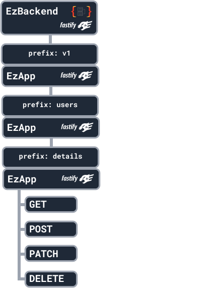
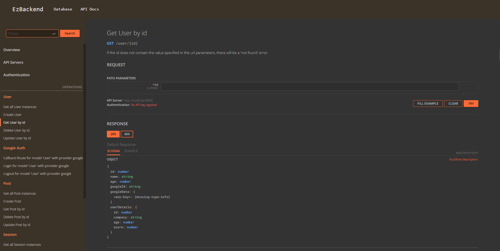

# EzApp - Basic Routing

import CodeSnippet from "../CodeSnippet";
import AllEndpointFormats from "../AllEndpointFormats"

## Overview

The EzApp is the `building block` of an EzBackend, and you can create routes on them as you wish.

EzApps can have children which inherit options from the parent

- If a parent has a route-prefix 'user'
- All child app routes with have route prefix 'user'

Everything in EzBackend is derived from EzApp

- All Plugins are EzApps
- EzBackend is an EzApp
- EzModel is an EzApp
- EzRepo is an EzApp

:::info
If all you need are Create, Read, Update, Delete (CRUD) endpoints for your database, refer to the [EzModel](./create-a-schema) docs instead
:::

## Sample structure

The sample below creates a get, post, patch and delete request at the url `/v1/users/details`

<CodeSnippet
  sample={`const app = new EzBackend()
const v1 = new EzApp()
const users = new EzApp()
const details = new EzApp()\n
app.addApp(v1,{prefix:'v1'})
v1.addApp(users,{prefix:'users'})
users.addApp(details,{prefix:'details'})\n
details.get(...)
details.post(...)
details.patch(...)
details.delete(...)\n
app.start()`}
  fullCode={`import {EzApp, EzBackend} from "@ezbackend/common"
import { EzOpenAPI } from "@ezbackend/openapi";
import { EzDbUI } from "@ezbackend/db-ui";
import { EzCors } from "@ezbackend/cors";\n
const app = new EzBackend();\n
//---Plugins---
app.addApp(new EzOpenAPI());
app.addApp(new EzDbUI());
app.addApp(new EzCors());
//---Plugins---\n
const v1 = new EzApp()
const users = new EzApp()
const details = new EzApp()\n
app.addApp(v1,{prefix:'v1'})
v1.addApp(users,{prefix:'users'})
users.addApp(details,{prefix:'details'})\n
details.get('/',async (req,res) => {
  return {name: "Robert"}
})\n
details.post('/',async (req,res) => {
  return {created: true}
})\n
details.patch('/',async (req,res) => {
  return {updated: true}
})\n
details.delete('/',async (req,res) => {
  return {deleted: true}
})\n
app.start()`}
/>

## Viewing Available Routes

All created routes are automatically documented and displayed in the db-ui

You can access the db-ui at [http://localhost:8000/db-ui/](http://localhost:8000/db-ui/api-documentation) (Assuming port 8000)

## Creating routes

Creating a route in ezbackend can be done similarly to express or fastify.

There are three ways each route can be created:

1. Async shorthand
2. Sync shorthand
3. Full Declaration

### Get

Create an endpoint on the app which returns a json when a `GET` request is performed

<AllEndpointFormats method="get" contents="" returns={`{data: "data"}`} />

### Post

Create an endpoint on the app which returns a json when a `POST` request is performed

<AllEndpointFormats method="post" contents="" returns={`{data: req.body}`} />

### Put

Create an endpoint on the app which returns a json when a `PUT` request is performed

<AllEndpointFormats method="put" contents="" returns={`{data: req.body}`} />

### Patch

Create an endpoint on the app which returns a json when a `PATCH` request is performed

<AllEndpointFormats method="patch" contents="" returns={`{data: req.body}`} />

### Delete

Create an endpoint on the app which returns a json when a `DELETE` request is performed

<AllEndpointFormats method="delete" contents="" returns={`{data: req.body}`} />

## Route options

Route options can be used to add additional functionality to your routes

### schema

The schema ensures that input and output data is of the correct format.

The schemas provided must be in [JSON Schema](https://json-schema.org/) format.

`body` - Validates the request body for `POST`,`PUT` and `PATCH` methods

`query` - Validates the request query string (e.g api.your-app.com?name=bob&age=25)

`params` - Validates the params (e.g api.your-app.com/user/:userId)

`response` - Filters the output, according to status code (e.g if the status is 200 OK, it will follow the 200 schema)

Defining these values will also populate the documentation automatically

<AllEndpointFormats
  method="post"
  contents=""
  options={`schema:{
  body: <YOUR JSON SCHEMA>,
  query: <YOUR JSON SCHEMA>,
  params: <YOUR JSON SCHEMA>,
  response:
    200: <YOUR JSON SCHEMA>
}`}
  returns={`{data: req.body}`}
/>

### prefixTrailingSlash

prefixTrailingSlash: string used to determine how to handle passing / as a route with a prefix.

`both (default)`: Will register both /prefix and /prefix/.

`slash`: Will register only /prefix/.

`no-slash`: Will register only /prefix.

<AllEndpointFormats
  url="/prefix"
  method="post"
  contents=""
  options={`prefixTrailingSlash:'both' //'both'|'slash'|'no-slash'`}
  returns={`{data: req.body}`}
/>

## Documenting Routes

You can refer to the [DB UI](../db-ui/testing-endpoints#documenting-routes) documentation for specifying how your documentation should look like in the DB-UI or OpenAPI specification

## Route Prefixing

When adding apps to apps, you can specify the prefix in the options in order to prefix all the routes in the app and all children apps

<CodeSnippet sample={`app.addApp(childApp, { prefix: "hello-world" });`} fullCode={`import { EzBackend, EzApp } from "@ezbackend/common";\n
const app = new EzBackend();
const childApp = new EzApp();\n
childApp.get("/", async (req, res) => {
  return { hello: "world" };
});\n
app.addApp(childApp, { prefix: "hello-world" }); //PREFIX HERE
app.start();`} />

## Additional Functionality

EzApps are expose the functionality of fastify objects, so anything that would [work in fastify](https://www.fastify.io/docs/latest/Routes/) would also work here.
