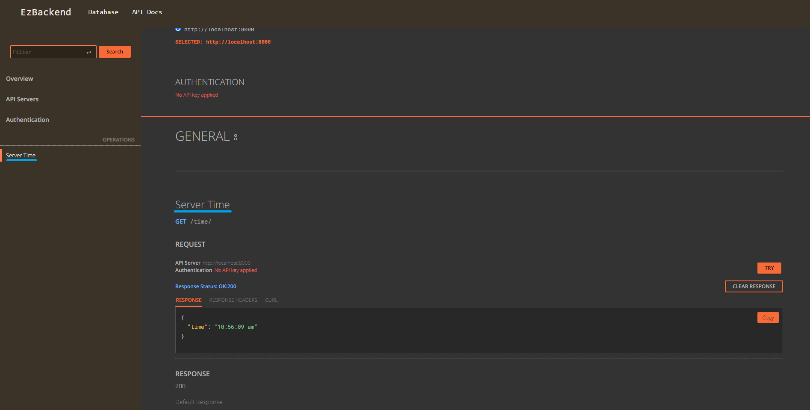
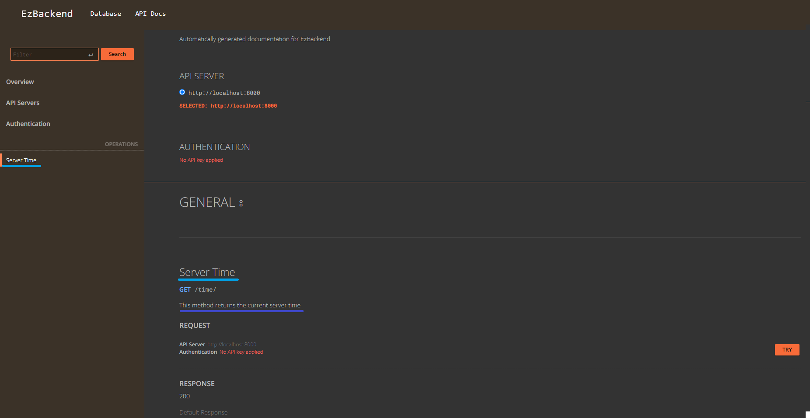

# EzApp - Basic Routing

import CodeSnippet from '../CodeSnippet';
import AllEndpointFormats from '../AllEndpointFormats';

## Overview


The EzApp is the `building block` of an EzBackend, and you can create routes on them as you wish.

EzApps can have children which inherit options from the parent

- If a parent has a route-prefix 'user'
- All child app routes with have route prefix 'user'

Everything in EzBackend is derived from EzApp

- All Plugins are EzApps
- EzBackend is an EzApp
- EzModel is an EzApp
- EzRepo is an EzApp

:::info
If all you need are Create, Read, Update, Delete (CRUD) endpoints for your database, refer to the [EzModel](./create-a-schema) docs instead
:::

## Sample structure

The sample below creates a get, post, patch and delete request at the url `/v1/users/details`


<CodeSnippet
  sample={`const app = new EzBackend()
const v1 = new EzApp()
const users = new EzApp()
const details = new EzApp()\n
app.addApp(v1,{prefix:'v1'})
v1.addApp(users,{prefix:'users'})
users.addApp(details,{prefix:'details'})\n
details.get(...)
details.post(...)
details.patch(...)
details.delete(...)\n
app.start()`}
  fullCode={`import {EzApp, EzBackend} from "@ezbackend/common"
import { EzOpenAPI } from "@ezbackend/openapi";
import { EzDbUI } from "@ezbackend/db-ui";
import { EzCors } from "@ezbackend/cors";\n
const app = new EzBackend();\n
//---Plugins---
app.addApp(new EzOpenAPI());
app.addApp(new EzDbUI());
app.addApp(new EzCors());
//---Plugins---\n
const v1 = new EzApp()
const users = new EzApp()
const details = new EzApp()\n
app.addApp(v1,{prefix:'v1'})
v1.addApp(users,{prefix:'users'})
users.addApp(details,{prefix:'details'})\n
details.get('/',async (req,res) => {
  return {name: "Robert"}
})\n
details.post('/',async (req,res) => {
  return {created: true}
})\n
details.patch('/',async (req,res) => {
  return {updated: true}
})\n
details.delete('/',async (req,res) => {
  return {deleted: true}
})\n
app.start()`}
/>

## Viewing Available Routes

All created routes are automatically documented and displayed in the db-ui

You can access the db-ui at [http://localhost:8000/db-ui/](http://localhost:8000/db-ui/api-documentation) (Assuming port 8000)


## Creating routes

Creating a route in ezbackend can be done similarly to express or fastify.

There are three ways each route can be created:

1. Async shorthand
2. Sync shorthand
3. Full Declaration

### Get

Create an endpoint on the app which returns a json when a `GET` request is performed

<AllEndpointFormats
  method="get"
  contents=""
  returns={`{data: "data"}`}
  options={`reply200: Response`}
  additionalPreCode={`export class Response {
  data: string
}`}
/>

### Post

Create an endpoint on the app which returns a json when a `POST` request is performed

<AllEndpointFormats
  method="post"
  contents=""
  returns={`{data: req.body}`}
  options={`body: Person
reply200: Response`}
  additionalPreCode={`export class Person {
  name: string
}\n
export class Response {
  data: Person
}`}
/>

### Put

Create an endpoint on the app which returns a json when a `PUT` request is performed

<AllEndpointFormats
  method="put"
  contents=""
  returns={`{data: req.body}`}
  options={`body: Person
reply200: Response`}
  additionalPreCode={`export class Person {
  name: string
}\n
export class Response {
  data: Person
}`}
/>

### Patch

Create an endpoint on the app which returns a json when a `PATCH` request is performed

<AllEndpointFormats
  method="patch"
  contents=""
  returns={`{data: req.body}`}
  options={`body: Person
reply200: Response`}
  additionalPreCode={`export class Person {
  name: string
}\n
export class Response {
  data: Person
}`}
/>

### Delete

Create an endpoint on the app which returns a json when a `DELETE` request is performed

<AllEndpointFormats
  method="delete"
  contents=""
  returns={`{data: req.body}`}
  options={`body: Person
reply200: Response`}
  additionalPreCode={`export class Person {
  name: string
}\n
export class Response {
  data: Person
}`}
/>

## Route Validation / Documenting Routes

EzBackend allows you to use TypeScript classes for route validation.

<CodeSnippet
  sample={`export class Body {
  var1: string,
  var2?: number,
  var3: boolean,
  var4: 'enum1' | 'enum2'
}\n
app.post('/', {
  querystring: QueryString,
  headers: Headers,
  body: Body,
  reply200: Reply,
  summary: "A summary of the endpoint",
  description: "A description of the endpoint"
}, async (req,res) => {
  ...
})`}
  fullCode={`import { EzApp, EzBackend } from '@ezbackend/common';
import { EzOpenAPI } from '@ezbackend/openapi';\n
export class Person {
  name: string
  age: number
  gender: 'male' | 'female'
}\n
const app = new EzBackend();\n
//Plugins
app.addApp(new EzOpenAPI());\n
const genderSwapper = new EzApp()\n
genderSwapper.post('/', {
  querystring: Person,
  headers: Person,
  body: Person,
  reply200: Person
}, async (req,res) => {
  const newPerson = {...req.body}
  if (newPerson.gender === 'male') {
    newPerson.gender = 'female'
  } else {
    newPerson.gender = 'male'
  }
  return newPerson
})\n
app.addApp(genderSwapper,{prefix: 'gender-swap'})\n
app.start();\n
`}
/>

By specifying the input using classes, you get:

1. Automatic Documentation
2. Input/Output Validation
3. Typescript type safety within the handler

:::info
If you see the warning `no auto documentation nor input validation provided`, it means that you have to specify Typescript classes or JSON Schema for automatic documentation to work.
:::

### Schema Definition

<!-- TODO: Extend these schema definitions to give users a better idea of how to use it -->

To use a schema within EzBackend it needs to be exported from the top level file.

For this reason, all schemas used within a single EzBackend project need to have unique names as well.

```ts
export class Person {
  name: string;
  age: number;
  gender: 'male' | 'female';
}
```

Additional JsDoc annotations can also be used to extend the default types

```ts
// This adds a format:email field in the generated schema, which is reflected in the auto-generated-docs

export class Person {
  /**@format email */
  email: string;
}
```

After creating a class you can use it in your routes for validation and automatic documentation. All the possible endpoints types are listed below. Currently Typescript Class validation only supports `200` and `400` type responses, if you need to define it for other error codes you can use [JSON Schema](#json-schema)

```ts
export class QueryString {data:any}
export class Headers {data:any}
export class Body {data:any}
export class Params {data:any}
export class Reply200 {data:any}
export class Reply400 {data:any}

app.post('/', {
  body: Body,
  params: Params,
  querystring: QueryString,
  headers: Headers,
  reply200: Reply200,
  reply400: Reply400,
  summary: 'summary',
  description: 'description'
}, async (req,res) => {
  return {}
})
```

EzBackend uses [ts-json-schema-generator](https://github.com/vega/ts-json-schema-generator) to convert Typescript classes to the appropriate types.

### Summary

You can provide a summary of what your route, which will be reflected in the `Db-UI`



<AllEndpointFormats
  method="get"
  contents="const time = new Date().toLocaleTimeString()"
  options={`summary: "Server Time"`}
  returns={`{time: time}`}
/>

### Description

You can provide a detailed description of what your route does, which will be reflected in the `Db-UI`



<AllEndpointFormats
  method="get"
  contents="const time = new Date().toLocaleTimeString()"
  options={`summary: "Server Time",
  description: "This method returns the current server time"`}
  returns={`{time: time}`}
/>

### Schema Caching

When `NODE_ENV` is not set to `production`, json-schemas of the exported classes are stored in a auto-generated folder, `schemas`

The folder `schemas` should be treated as code and committed in version control.

### Running in Production

When `NODE_ENV` is set to `production`, instead of generating the json-schema on-the-fly (which is the default for non-production mode), validation schemas are obtained from the `schemas` folder to reduce startup time.

### JSON Schema

If you find any limitations with the automatic schema generation, or you are not using typescript, you can fall back to JSON Schema for route validation.

The schemas provided must be in [JSON Schema](https://json-schema.org/) format.

`body` - Validates the request body for `POST`,`PUT` and `PATCH` methods

`query` - Validates the request query string (e.g api.your-app.com?name=bob&age=25)

`params` - Validates the params (e.g api.your-app.com/user/:userId)

`response` - Filters the output, according to status code (e.g if the status is 200 OK, it will follow the 200 schema)

Defining these values will also populate the documentation automatically

<AllEndpointFormats
  method="post"
  contents=""
  options={`schema:{
  body: <YOUR JSON SCHEMA>,
  query: <YOUR JSON SCHEMA>,
  params: <YOUR JSON SCHEMA>,
  response:
    200: <YOUR JSON SCHEMA>
}`}
  returns={`{data: req.body}`}
/>

### Configuration

You can configure the automatic documentation functionality by setting certain environment variables

These values can be set in `.env` and will automatically be loaded

| Variable         | Description                                                      | Sample                        |
| ---------------- | ---------------------------------------------------------------- | ----------------------------- |
| ENTRY_POINT_PATH | The path of the file from which all your types are exported from | ENTRY_POINT_PATH=src/index.ts |
| TS_CONFIG_PATH   | The path of your tsconfig.json                                   | TS_CONFIG_PATH=tsconfig.json  |
| SCHEMA_DIR       | The folder name where schemas are stored                         | SCHEMA_DIR=schemas            |

## Route options

Route options can be used to add additional functionality to your routes

### prefixTrailingSlash

prefixTrailingSlash: string used to determine how to handle passing / as a route with a prefix.

`both (default)`: Will register both /prefix and /prefix/.

`slash`: Will register only /prefix/.

`no-slash`: Will register only /prefix.

<AllEndpointFormats
  url="/prefix"
  method="post"
  contents=""
  options={`prefixTrailingSlash:'both' //'both'|'slash'|'no-slash'`}
  returns={`{data: req.body}`}
/>

## Route Prefixing

When adding apps to apps, you can specify the prefix in the options in order to prefix all the routes in the app and all children apps

<CodeSnippet
  sample={`app.addApp(childApp, { prefix: "hello-world" });`}
  fullCode={`import { EzBackend, EzApp } from "@ezbackend/common";\n
const app = new EzBackend();
const childApp = new EzApp();\n
childApp.get("/", async (req, res) => {
  return { hello: "world" };
});\n
app.addApp(childApp, { prefix: "hello-world" }); //PREFIX HERE
app.start();`}
/>

## Additional Functionality

EzApps are expose the functionality of fastify objects, so anything that would [work in fastify](https://www.fastify.io/docs/latest/Reference/Routes/) would also work here.
