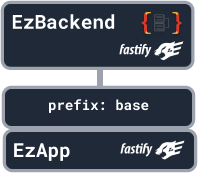

# Basic Routing

The EzApp is the building block of an EzBackend, and you can create routes on them as you wish

Lets say we have the following app


```ts
const app = new EzBackend();

const timeApp = new EzApp();

app.addApp("time", timeApp, { prefix: "time" });

app.start();
```

:::info
We highly recommend using the [recommended plugins](./running-the-server) to make development easier
:::

## Creating routes

Creating a route in ezbackend can be done similarly to express or fastify

### Sync

```ts
timeApp.get("/", function (req, res) {
  const timeString = new Date().toLocaleTimeString();
  res.send({ time: timeString });
});
```

### Async

```ts
timeApp.get("/", async (req, res) => {
  const timeString = new Date().toLocaleTimeString();
  return { time: timeString };
});
```

You can view the results of these at http://localhost:8000/time

## Other HTTP Methods

You can define any HTTP Route you need with these shorthand methods



<!-- URGENT TODO: Fix bug where defining routes on EzBackend itself does not appear on openapi -->
```ts
const app = new EzBackend()
const base = new EzApp()

base.get('/', async(req,res) => {
  return {hello:'world'}
})

base.post('/', async(req,res) => {
  return req.body
})

base.patch('/', async(req,res) => {
  return req.body
})

base.delete('/', async(req,res) => {
  return req.body
})

base.get('/some-random-route-name', async(req,res) => {
    return {hello:'world'}
})

base.get('/:someValue', async (req,res) => {
    return {value:req.params['someValue']}
})

app.addApp('base',base)
app.start()
```

## Route Prefixing
EzApps are the core of EzBackend, and they power the entire encapsulation system. When adding apps to apps, you can specify the prefix in the options in order to prefix all the routes in the app and all children apps

```ts {8}
const app = new EzBackend()
const base = new EzApp()

base.get('/', async(req,res) => {
  return {hello:'world'}
})

app.addApp('base',base, {prefix:'base'}) //PREFIX HERE
app.start()
```


## Additional Functionality

EzApps are expost the functionality of fastify objects, so anything that would [work in fastify](https://www.fastify.io/docs/latest/Routes/) would also work here.