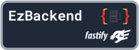
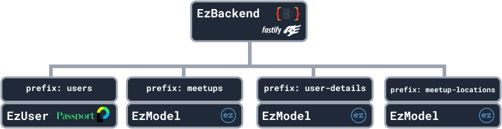
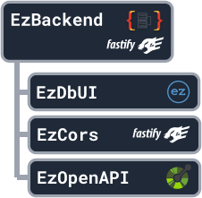

# EzBackend - Running the server

import CodeSnippet from '../CodeSnippet'



The EzBackend is the root [EzApp](./basic-routing). All other EzApps should be children of the EzBackend, and there should be only one EzBackend per application. A sample meetup app may look something like:



## Recommended Setup

We recommend following the instructions in [Getting Started](../getting-started)

Which creates the following boilerplate



<CodeSnippet
  sample={`const app = new EzBackend();\n
//---Plugins---
app.addApp(new EzOpenAPI());
app.addApp(new EzDbUI());
app.addApp(new EzCors());
//---Plugins---\n
app.start();`}
  fullCode={`import { EzBackend } from "@ezbackend/common";
import { EzOpenAPI } from "@ezbackend/openapi";
import { EzDbUI } from "@ezbackend/db-ui";
import { EzCors } from "@ezbackend/cors";\n
const app = new EzBackend();\n
//---Plugins---
app.addApp(new EzOpenAPI());
app.addApp(new EzDbUI());
app.addApp(new EzCors());
//---Plugins---\n
app.start();`}
/>

This basic boilerplate comes with three plugins to aid development

|Plugin|Description|Notes|
|-|-|-|
||An all in one interface for <br/>1. Looking at your API endpoints <br/>2. Managing your database<br/>3. Testing your API endpoints|`Requires EzOpenAPI plugin to be used as well`|
||Automatically generates documentation for your backend||
||Plugin for managing CORS, by default accepts requests from anywhere| `Make sure to change cors settings before deployment`|

## Barebones

If you just want a barebones application, you can use the following

```ts
import { EzBackend } from "@ezbackend/common";

const app = new EzBackend();

app.start();
```

:::caution
However, this barebones application does not have alot of the functionality that EzBackend provides to make your life easier.
:::
