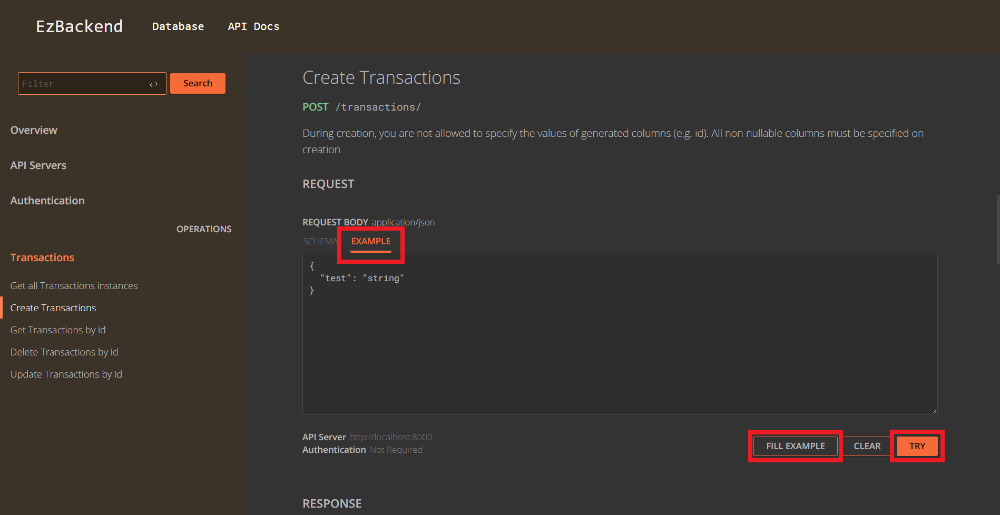

# OpenAPI (Swagger)

import AllEndpointFormats from "../AllEndpointFormats"

You can directly test your APIs from the DB UI without needing external tools like postman

## Testing Endpoints

In order for you to be able to test your endpoints on the DB UI, you need to specify the `body`, `query`, `params` and `responses` of the endpoint.

You can refer to the [EzApp - Basic Routing](../basics/basic-routing#route-options) schema docs for a full list of specifications.

:::info
Even if you make an endpoint, if you don't specify the `body`, `query`, `params` and `responses` of the endpoint you will not be able to test them properly on the DB-UI
:::

### Navigating the interface

`EXAMPLE` - Click on this tab in order to open an interface to type sample request data for the `body` of an `application/json` request

`FILL EXAMPLE` - Click this button to prefill the example with a valid input

`TRY` - Send the API request

### Missing Params

If you are missing a field for entering params, you probably have to define the `schema` for it. You can refer to the [EzApp - Basic Routing](../basics/basic-routing#route-options) schema docs for this.

## Caveats

The data in DB-UI will not be available if the `ENV` environment variable is set to `production`. This is to prevent hostile agents from getting full access to your endpoint documentation.