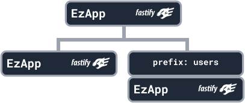
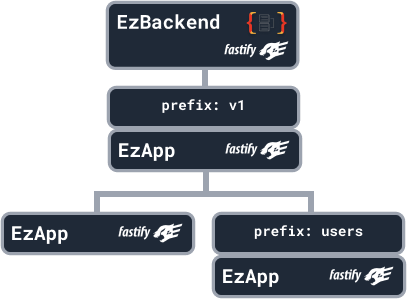

# Overview

import Tabs from "@theme/Tabs";
import TabItem from "@theme/TabItem";
import CodeBlock from "@theme/CodeBlock";
import CodeSnippet from "./CodeSnippet.jsx";

The basic building block of EzBackend is the EzApp

<CodeSnippet
  sample={`const app = new EzApp();`}
  fullCode={`import {EzApp} from "@ezbackend/common" \n
const app = new EzApp();`}
/>

The EzApp can have child EzApps, and any options specified on an EzApp will propagate to all its children.

<CodeSnippet
  sample={`const leftApp = new EzApp();
const userApp = new EzApp();
app.addApp(leftApp);
app.addApp(userApp, { prefix: "users" });`}
  fullCode={`import {EzApp} from "@ezbackend/common" \n
const leftApp = new EzApp();
const userApp = new EzApp();
app.addApp(leftApp);
app.addApp(userApp, { prefix: "users" });`}
/>

In the above example, the EzApp has no route prefix, so all http routes on it will have the prefix `/`

However, the EzApp on the right was added to the parent with the route prefix `users`, so all its children will have the prefix `/users/`

<CodeSnippet
  sample={`const app = new EzBackend()\n
const v1 = new EzApp()\n
app.addApp(v1, {prefix: 'v1'})
.
.
v1.addApp(...)
.
.
app.start()`}
  fullCode={`import { EzBackend, EzApp } from "@ezbackend/common";
const app = new EzBackend();\n
const v1 = new EzApp();\n
const leftApp = new EzApp();
const userApp = new EzApp();
v1.addApp(leftApp);
v1.addApp(userApp, { prefix: "users" });\n
app.addApp(v1, { prefix: "v1" });\n
app.start();`}
/>

The topmost parent of an EzBackend must be a `EzBackend`, as the parent EzBackend runs the initialization code in its lifecycle for all child apps to work.
