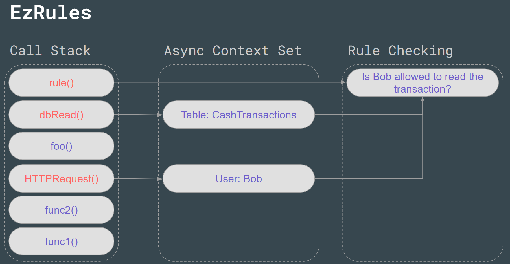

# EzRules

import CodeSnippet from "../CodeSnippet"

You can use EzRules to prevent unauthorized socket.io packets or HTTP requests from returning data to malicious users.

## Setting a Rule

Each EzModel has EzRules which can be set with the following syntax

<CodeSnippet
sample={`model.rules.for(RuleType.CREATE).check((req,event) => {
    if (/** Your Condition here */) throw Boom.unauthorized()
})`}
fullCode={`import { EzBackend, EzModel, RuleType, Type } from "@ezbackend/common"
import { EzOpenAPI } from "@ezbackend/openapi"
import { EzDbUI } from "@ezbackend/db-ui"
import Boom from "@hapi/boom"\n
const app = new EzBackend()\n
//plugins
app.addApp(new EzOpenAPI())
app.addApp(new EzDbUI())\n
//Bank Transaction Example
const transactions = new EzModel("Transactions", {
    receiver: Type.VARCHAR,
    sender: Type.VARCHAR,
    amount: Type.INT
})\n
transactions.rules.for(RuleType.CREATE).check((req,event) => {
    //Don't allow creating a transaction unless the sender is the user
    if (req.user.id !== event.entity.sender) throw Boom.unauthorized()
})\n
app.addApp(transactions, { prefix: "transactions" })\n
app.start()`}
/>

In the rule, to prevent further execution of the code (e.g a HTTP reply being sent or a socket.io packet being sent), you need to throw an error.

## Available Rule Types

You can add rules for multiple RuleTypes, for example:

```ts
model.rules.for(
    RuleType.CREATE,
    RuleType.READ,
    RuleType.UPDATE,
    RuleType.DELETE
).check((req, event) => {
    if (/** Your Condition here */) throw Boom.unauthorized()
})
```

:::info
To prevent a user from receiving unauthorized socket.io packet updates, set the `RuleType.READ` property
:::


## How it works

EzRules works using [async local storage](https://github.com/kibertoad/asynchronous-local-storage) in order to save requests contexts through the call stack.



In the above example

1. A HTTP Request is made
1. A fastify preHandler sets `req.user` to `Bob`
1. This `req` is saved in the context
1. the HTTP Request handler calls `foo()`
1. `foo()` results in a database read
1. Entities are read from `CashTransactions`
1. The `entities` are saved in the context
1. Since there is a `req` context and a `entity` context, the rules are checked to see if Bob has permission to read the transaction