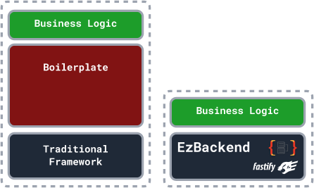
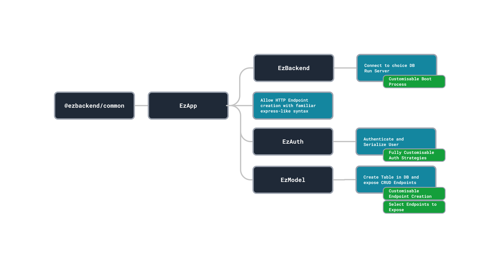
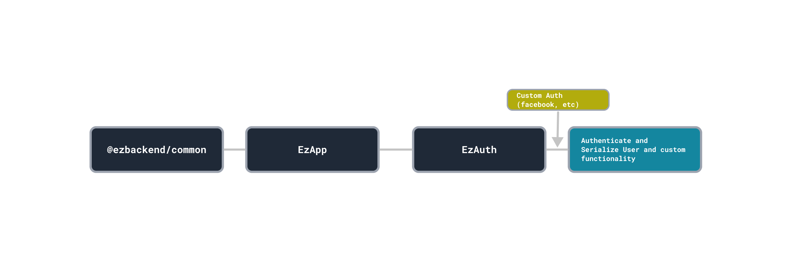

## Why Less is More

Current backend frameworks often result in developers reinventing the wheel. When new webapps are created, often the same boilerplate code is used repeatedly to connect to the backend, set up API endpoints and add authentication.

This results in your codebase being cluttered with code that does not directly translate to business goals.

Users do not care about what login provider you use, nor do they care what headers are specified in each API endpoint specified.

What users care about is your app's value proposition, which is served to the user by writing business logic.

EzBackend saves you time and effort by reducing the time you spend writing boilerplate code and increasing time spent on serving your user's needs.

## How EzBackend saves you time

EzBackend saves you time with convention over configuration - EzBackend comes with strong defaults that are <!--[built to scale](built-to-scale) and--> [fully configurable](../docs/basics/configuration).

<!-- TODO: CROP -->

EzBackend does this with a modular system of building blocks that allow you to add tables to your database, generate API documentation, implement authentication and more with very little code

## Configuring EzBackend Defaults

A possible concern you might have is whether the auto-generated functionality, such as CRUD endpoints and authentication are customisable to your business needs.

<!-- TODO: CROP -->

Because of the modular, fully customisable nature of EzBackend, you can inject your custom functionality wherever needed to configure or remove the auto-generated functionlality

## Comparing Express/Postgres to EzBackend

:::caution
Lines of code is not a clear indicator of time saved. While this metric serves to give the user an idea of possible time-savings, it should be taken with a grain of salt.
:::

To compare the reduction in boilerplate code, we developed two backends

1. Express + Postgres
2. EzBackend

With the following criteria:

1. Postgres Database
2. Two DB Tables
   1. Users Table
   2. Posts Table
3. Google Auth
4. CRUD Endpoints

You can view the sample apps [here](https://github.com/kapydev/ezbackend-comparisons)

| Framework                           | Number of Files | blankLines | Comments | Code |
| ----------------------------------- | --------------- | ---------- | -------- | ---- |
| lineCount-ezbackend-postgres-sample | 1               | 6          | 4        | 31   |
| lineCount-express-mongo-sample      | 9               | 46         | 12       | 147  |
| lineCount-express-postgres-sample   | 11              | 43         | 13       | 179  |

### Additional Functionality in EzBackend

Some features built into EzBackend were not included in the other backends to prevent bloat. These include:

1. Database viewer and editor
2. Automated OpenAPI documentation
3. Input and output request validation
4. Error Handling
5. Logging

### Speed Comparisons

Despite the reduction in code, EzBackend still provides the same performance, if not greater. [View the benchmarks here]('./../benchmarks)
